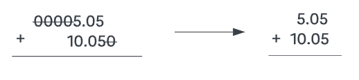
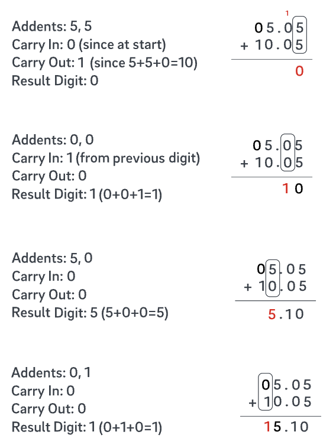

# CSE 11 Summer Session I 2023 PA2 - Calculator

**Due date: Sunday, July 16 @ 11:59PM PDT**

## Provided Files

None

## Goal

In this assignment, we will practice implementing subroutines as methods for reusability and readability. We'll implement static methods with a variety of different return types and parameters.

## Overview

- Calculator [Gradescope, 100 points]

## Calculator [100 Points]

In Java, doubles follow the [IEEE Standard for Floating-Point Arithmetic](https://en.wikipedia.org/wiki/IEEE_754) and are **not accurately represented**. For example, when running the following code snippet,

```java
double firstNumber = 4.02;
double secondNumber = 0.05;
System.out.println(firstNumber + secondNumber);
```

we get `4.069999999999999` instead of `4.07`. 

There are different approaches to fix this unavoidable issue, such as [BigDecimal](https://docs.oracle.com/en/java/javase/17/docs/api/java.base/java/math/BigDecimal.html). In this PA, you will be creating another solution, which is to implement the **addition of two doubles in a String representation**.

Your file should be named `Calculator.java` and should contain a single class `Calculator`.

### Format of `Strings`

The Strings in this assignment each represent a double in String format. Strings are guaranteed to contain at least one digit and at most a single decimal point that can appear anywhere in the String. The `Invalid Examples` below will not be tested.

Valid Examples:

- `".1"`
- `"0.1"`
- `"00.1"`
- `"1"`
- `"1."`
- `"1.0"`

Invalid Examples:

- `""`
- `"."`
- `"+1.0"`
- `"-1.0"`
- `"1.0f"`
- `"1e9"`
- `null`

### Methods

> __Warning__ 
>
> Do not import or use any libraries such as `BigDecimal` or `Scanner`. You should not have any `import` statements for this PA.
>
> Additionally, do not parse the Strings into ints, doubles or floats using `Integer.praseInt`, `Integer.valueOf`, `Double.parseDouble`, `Double.valueOf`, `Float.parseFloat`, `Float.valueOf` etc. This includes using `new Integer(), new Double(), new Float()` since this is essentially parsing the String into ints, doubles and floats.
>
> Doing so will result in a 0 for this assignment.

You are free to create additional helper methods but make sure they are `private static`. 

**Number Extraction**

- `public static String extractWholeNumber(String number)`
  - Return the whole number part of the number without removing leading zeros.
  - If `number` contains no whole number part (e.g. `".1"`), return empty string `""`.
  - E.g. `extractWholeNumber("012.340")` returns `"012"`
- `public static String extractDecimal(String number)`
  - Return the decimal part of the number without removing trailing zeros.
  - If `number` does not contain a decimal point or there are no digits after the decimal point (e.g. `"1", "1."`), return empty string `""`.
  - E.g. `extractDecimal("12.340")` returns `"340"`

**Alignment and Formatting**

- `public static String prependZeros(String number, int numZeros)`
  - Return the result of prepending `numZeros` number of zeros to `number`.
  - If `numZeros` is negative, return `number`.
  - E.g. `prependZeros("1", 3)` returns `"0001"`

- `public static String appendZeros(String number, int numZeros)`
  - Return the result of appending `numZeros` number of zeros to `number`.
  - If `numZeros` is negative, return `number`.
  - E.g. `appendZeros("1", 3)` returns `"1000"`

- `public static String formatResult(String number)`
  - Return the result of removing all leading and trailing zeros from `number` unless it is the only zero before or after the decimal. 
  - Additionally, ensure there exists a decimal point and there are digits before and after the decimal point. 
  - E.g. `formatResult("023.00")` returns `"23.0"`, `formatResult("2300")` returns `"2300.0"`, `formatResult(".1")` returns `"0.1"`, `formatResult("0")` returns `"0.0"`

**Single Digit Adder**

Your goal is to implement a single digit adder that adds 2 digits (`firstDigit` and `secondDigit`) and `carryIn` together. `firstDigit` and `secondDigit` are single digits represented by a `char` extracted from the inputs. `carryIn` is `true` when the addition in the previous column results in a [carry](https://en.wikipedia.org/wiki/Carry_(arithmetic)); `false` if it does not.

- `public static char addDigits(char firstDigit, char secondDigit, boolean carryIn)`
  - Return the rightmost digit of the sum `firstDigit`, `secondDigit`, and `carryIn`.
  - If the sum has two digits and `carryIn` is false (i.e. '9' + '4' = '13'), return the rightmost digit `'3'`.
- `public static boolean carryOut(char firstDigit, char secondDigit, boolean carryIn)`
  - Return `true` if adding `firstDigit`, `secondDigit`, and `carryIn` results in a carry. Otherwise, return `false`.

- Examples
  - `('1', '6', true)`
    $1 + 6 + 1 = 8$, so `addDigits('1', '6', true)` returns `'8'`, and `carryOut('1', '6', true)` returns `false`.
  - `('1', '3', false)`
    $1 + 3 + 0 = 4$, so `addDigits('1', '3', false)` returns `'4'`, and `carryOut('1', '3', false)` returns `false`.
  - `('8', '5', true)`
    $8 + 5 + 1 = 14$, so `addDigits('8', '5', true)` returns `'4'`, and `carryOut('8', '5', true)` returns `true`.

### Format of `Calculation` (add/multiply) Result

The two methods in the **Calculation** step below are `add` and `multiply`. The result for both of these methods should be a double in String format. If your results fall into the cases below where it does not satisfy the conditions mentioned, you need to handle it accordingly in the `add/multiply` methods.

Different cases:
- If there are no digits before the decimal point, prepend a `0`.
  - `".1"` $\to$ `"0.1"`
- If there is no decimal point, append a `.0`.
  - `"80"` $\to$ `"80.0"`
- If there is no digit after the decimal point, append a `0`.
  - `"80."` $\to$ `"80.0"`
- If there are leading or trailing zeros, then call `formatResult`.
  - `"00010.200"` $\to$ `"10.2"`
- The result should always be in the decimal form. Do not use scientific / exponential notation.
  - If the result is 1 trillion, it should be `"1000000000000.0"`, not `"1e12"`.

**Calculation**

- `public static String add(String firstNumber, String secondNumber)`
  - Return the result of numerically adding the doubles (in String representation) together.
  - E.g. `add("100.5", "0.1")` returns `"100.6"`
  - **Hint:** Use the helper methods from above to implement add.

- `public static String multiply(String number, int numTimes)`
  - Return the result of adding the double (in String representation) for `numTimes`.
  - If `numTimes` is negative or zero, return `"0.0"`.
  - E.g. `multiply("1", 3)` returns `"3.0"`

### Walk Through for Addition

```java
System.out.print(Calculator.add("00005.05", "10.050")); // should print 15.1
```

1. Call `formatResult()` to reduce redundant calculation.  


2. Align 2 addends to ensure number of digits before and after the decimal points are the same. Call `preppendZeros("5.05", 1)` here to align the whole number part.  


3. Adding the digits from right to left, one at a time, while keeping track of any carry-in and carry-out values.  


4. Strip the trailing zero by calling `formatResult()`. Call `formatResult("15.10")` returns `"15.1"`.

### Testing

For this PA, public testers can be found on Gradescope and there will be testers that are hidden that you will not be able to see. It is your responsibility to test your program comprehensively. 
The hidden tests are worth 33.5 points out of total 100 points.

Here's an example of how you can test your code.
(Do not include main method in your submission.)

```java     
public static void main(String[] args) {
    System.out.print(Calculator.add("4.02", "0.0050")); // should print 4.025
    System.out.print(Calculator.add("4.02", ".005"));   // should print 4.025
    System.out.print(Calculator.add("100", "200"));     // should print 300.0
    System.out.print(Calculator.multiply("100", 3));    // should print 300.0
}
```

## Submission & Grading

Submit the following file to Gradescope by **Sunday, July 16 @ 11:59PM PDT**.

- `Calculator.java`

Even if your code does not pass all the tests, you will still be able to submit your work to receive partial points for the tests that you passed. Make sure your code compiles in order to receive partial credit.

### How your assignment will be evaluated

- **Correctness** [100 points] You will earn points based on the autograder tests that your code passes. If the autograder tests are not able to run (e.g., your code does not compile or it does not match the specifications in this writeup), you may not earn any credit.
- The prototype of class `Calculator` is correct, which means that there are no other methods besides the required methods above and helper methods, and there are no fields except constants.
  Otherwise, you will receive a 0.
- No usage of any library methods except those in classes listed below.
  Otherwise, you will receive a 0.
  - `java.lang.Object`
  - `java.lang.String`
  - `java.lang.StringBuilder`
- No usage of any library fields except constants.
